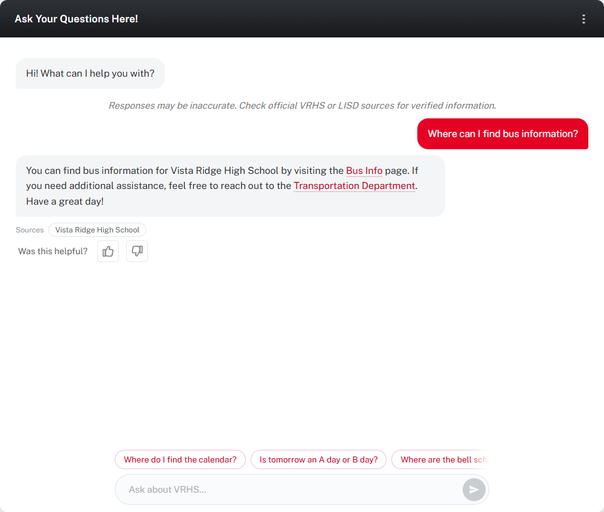
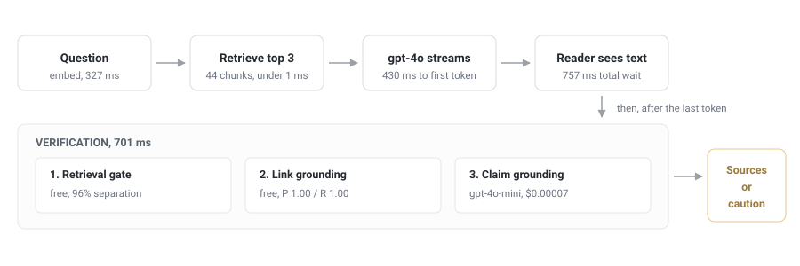
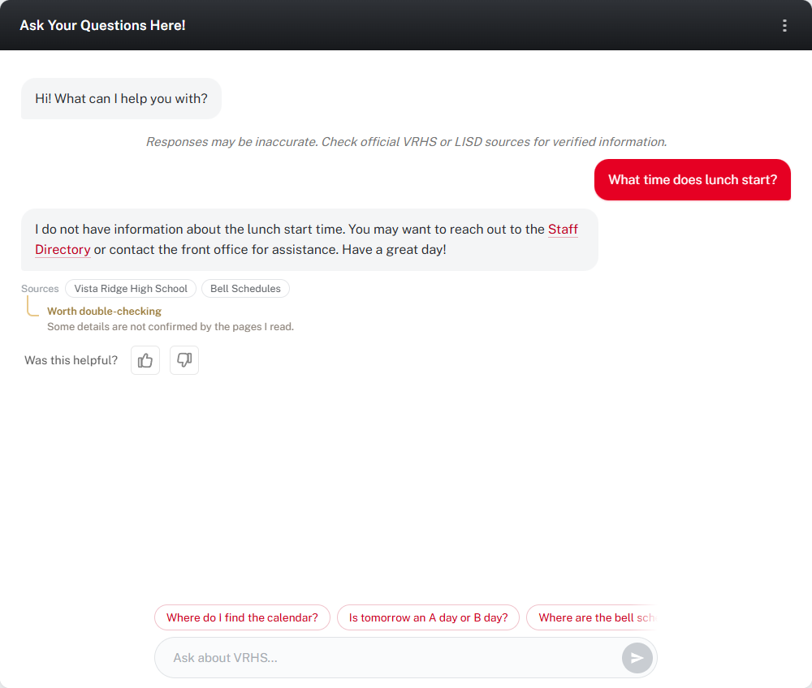

# VRHS Chatbot

A retrieval-augmented chatbot for Vista Ridge High School. It answers questions
from the school's own web pages, streams the answer as it is written, shows
which pages it drew from, and checks its own output for hallucination before
asking anyone to trust it.

Built by Saif Syed and Junayd Elhassan. The live deployment is linked in the
repository sidebar.



## What it does

* Answers from 218 chunks scraped off the live school site, not from model
  memory. The page list is discovered from the site's own navigation, so a
  year rollover does not break it.
* Streams tokens, so text appears after about 870 ms.
* Attaches **source pills** linking to the pages behind the answer.
* Runs three grounding checks and posts a short caution when one fails.
* Records thumbs ratings against retrieval scores, so gaps become visible.

## Architecture



The index is a JSON file of 218 vectors held in memory. At this size a vector
database would add operational weight and no speed: brute-force cosine over 218
vectors takes under a millisecond, which is three orders of magnitude below the
network round trip in front of it. The bottleneck is API latency, not search.

### Pages are discovered, not listed

Two of the original eleven URLs were year-scoped (`24-25-bell-schedules`) and
started returning 404 the moment the school rolled the site over, taking those
pages out of the corpus silently. Naming `26-27` instead would have failed the
same way next summer.

Ingest now reads the live navigation and follows links whose label or path
matches a topic it cares about, so the current bell schedule page is found by
what it is about rather than by its name. The seed list holds only stable
URLs. On the last run this found 14 pages, including two the hardcoded list had
never included.

### Links live inline, and each one is also its own chunk

The scraper used to append every link to an `Important Links` block at the end
of the page text. Chunking then split that block away from the prose that
explained it, producing chunks of bare URLs that matched nothing. Asking "where
can I find bus information" retrieved the paragraph naming *Bus Routes / Smart
Tag* at rank 1, while the chunk holding the only bus URL on the site sat at
**rank 27 of 44**. The answer named the page and could not link to it.

Two changes fixed it. Links are now inlined as `[label](url)` inside the
sentence that gives them meaning, and every unique link additionally becomes
its own small chunk keyed on its label. A page like `parent_resources` is
mostly a list of twenty links; at 150 words per chunk that was one blob
covering twenty unrelated topics, and its embedding was a blur that matched
none of them. Giving each link its own chunk makes the label the thing being
matched, which is what a "where do I find X" question is actually asking.

The same question now retrieves *Bus Info* at rank 1, and **100% of answerable
questions retrieve a context containing a usable link**, measured across the
eval set.

## The hallucination layer

The failure mode of a small RAG system is not wild invention. It is a fluent
answer built on retrieved text that does not support it. The concrete version
here is an invented URL: a student follows a link, gets a 404, and stops
trusting the tool.

Before any of that, the prompt tries to stop the problem happening. The model
is told to answer only from the retrieved context, never to infer times, dates,
fees, names or requirements the context does not state, never to construct a
URL, and to say plainly that it does not know rather than assemble something
plausible. Because the retrieval score is computed before generation and not
only after it, a weak match adds a further instruction telling the model the
site probably does not cover the question at all.

That is prevention, and it is cheap but not sufficient: a model told to abstain
still sometimes does not. The three checks below run after the fact and assume
prevention failed.

Three checks run on every answer, cheapest first.

| Check | Question it answers | Cost | Measured |
| --- | --- | --- | --- |
| Retrieval gate | Does the corpus cover this at all? | free | 96% separation, answerable vs out of scope |
| Link grounding | Does every URL appear verbatim in the context? | free | precision 1.00, recall 1.00 |
| Claim grounding | Does the context support each claim? | $0.00007 | precision 1.00, recall 1.00 |

Two decisions worth stating.

**Checks annotate, they never retract.** Verification can only run once the
answer exists as a whole, and by then the tokens are on screen. Deleting text
someone just read is worse than flagging it.

**The grader is not the generator.** Claim grounding runs on `gpt-4o-mini`
while answers come from `gpt-4o`. A grader that shares the generator's blind
spots will approve its mistakes.

When a check fails, the answer keeps its text and picks up a short note. The
panel is capped at two points, because an earlier version listed every
unsupported claim and buried the answer in hedging.



Sources are withheld when the gate says the corpus does not cover the question.
Citing a page that did not support the answer is its own kind of false
confidence.

## Picking a detection architecture

The LLM judge is the slowest and most expensive option, so it needed to earn
the slot. Five designs were built and measured against 20 labeled cases, 9 with
injected false claims and 11 grounded, drawn from real chunks in the corpus.

| Architecture | Precision | Recall | F1 | p50 latency | $/check |
| --- | --- | --- | --- | --- | --- |
| Lexical overlap | 0.889 | 0.889 | 0.889 | 0 ms | $0 |
| Embedding similarity | 0.800 | 0.889 | 0.842 | 303 ms | $0.000014 |
| Chain-of-Verification | 0.615 | 0.889 | 0.727 | 1,383 ms | $0.000150 |
| Cascade, lexical then LLM | 1.000 | 0.889 | 0.941 | 0 ms | $0.000025 |
| **LLM judge (`gpt-4o-mini`)** | **1.000** | **1.000** | **1.000** | 529 ms | $0.000072 |

What the numbers say:

**Chain-of-Verification lost, and that is the most useful result here.** CoVe
(Dhuliawala et al., 2023) is a published anti-hallucination method: plan
verification questions about the answer, answer them independently, then judge.
It scored precision 0.615, the worst of any option, at double the cost and
nearly three times the latency. The reason is diagnosable. Decomposition
generates questions about incidental details, and requiring the source to state
each one turns ordinary paraphrase into a false positive. Loosening the prompt
to accept paraphrase moved precision to 0.636 but cost recall, for a slightly
worse F1 of 0.700. It stays in `eval/detectors.py` as a measured alternative
rather than shipping because it sounds rigorous.

**Lexical overlap is a strong baseline.** F1 0.889 for nothing. Any argument
that a model call is necessary has to beat this first.

**Embedding similarity was the worst of the cheap options.** Sentence vectors
stay close to the context whenever the topic matches, and an injected false
claim usually keeps the topic. It fails exactly where it is needed.

**The cascade is the one to watch.** A lexical prefilter resolves the confident
cases and escalates only the ambiguous band, so 13 of 20 cases never made an API
call: F1 0.941 at a third of the cost and a 0 ms median.

**The judge ships** because at this volume the cost gap is meaningless. At
10,000 questions a month the judge costs $0.72 against the cascade's $0.25.
Paying $0.47 to recover the last 6 points of F1 is obviously right. The cascade
becomes the correct choice at roughly 100 times this traffic.

The two threshold-based detectors are reported at their best achievable F1, with
the threshold chosen on the same 20 cases that score them. That flatters them,
and the judge still wins.

## Feedback loop

Every answer carries a thumbs rating, and a thumbs-down opens three reasons:
not found, not up to date, inaccurate. Ratings used to change the on-screen text
and go nowhere. They now POST to `/feedback` and are stored with the question
and the retrieval diagnostics for that answer.

Pairing the two is the point. The rating alone says an answer was poor. With the
retrieval score attached it says why, and the two failures need different fixes:

| Pattern | Reading | Fix |
| --- | --- | --- |
| Thumbs-down, retrieval below the gate | The site does not cover this | Admin adds a page, or it becomes a manual entry |
| Thumbs-down, retrieval solid | Right page found, answer still poor | Prompt or chunking problem |
| Thumbs-down on a flagged answer | The layer already caught it | Working as intended |

## What changed and what it bought

| Change | Measured effect |
| --- | --- |
| Discovered pages from the live navigation instead of a hardcoded list | 2 URLs that 404'd on rollover fixed permanently, 14 pages found |
| Inlined links and gave each one its own chunk | bus URL **rank 27 to rank 1**, link-in-context **100%** |
| Extended link checking to bare URLs, not just markdown | recall **0.818 to 1.000** |
| Absolute cosine gate instead of a standard-score margin | separation **84% to 96%** |
| Corpus hygiene before embedding | index **263 to 218 chunks**, words **11,710 to 4,203**, top-3 up 6.7 points |
| LLM judge over the alternatives | F1 **0.727 to 1.000** against CoVe, for less cost |
| Verify after the last token, not before the first | perceived wait unchanged at **757 ms** |
| Index cached in memory instead of re-read per question | one file read and parse per process, not per question |
| Feedback wired to storage | ratings became data instead of a UI state change |

### Two source pages had been silently empty

The scraper wrapped each page in `try/except` and continued on failure. Two of
the eleven URLs were year-scoped (`24-25-bell-schedules`,
`clubs-organizations`) and began returning 404 when the school rolled the site
over. The corpus shipped without them and nothing said so.

They were repointed by hand first, which fixed the symptom and left the cause:
the next rollover would break the same way. Ingest now discovers pages from the
live navigation, so the current bell schedule page is found by what it is
about. The scraper also reports any page that yields no chunks, so a future
gap is loud rather than silent.

### The retrieval threshold was wrong twice

1. **Intuition.** Cutoffs of 0.82 and 0.76, picked from a general sense of where
   ada-002 sits. No evidence.
2. **Corpus analysis said absolute cutoffs were impossible.** Unrelated chunks
   had a median cosine of 0.8920 while a perfect match sat at 0.8802 for the
   5th percentile, measured on the corpus as it stood then. Overlapping, so no single cutoff works. That argued for a
   scale-free standard score.
3. **Real questions reversed it.** Step 2 used chunks as stand-in queries, and
   chunks are the one thing carrying the navigation boilerplate that inflated
   the baseline. Real questions are short and carry none of it.

| Signal | Best cutoff | Separation |
| --- | --- | --- |
| **Raw top-1 cosine** | 0.780 | **96%** |
| Standard-score margin | 2.42 | 84% |

The threshold that had been discarded was correct. The proxy experiment was
measuring the wrong thing. A proxy measurement can be worse than no measurement,
because it is persuasive.

### Three quarters of the corpus was navigation

Both corpora below come from the same scrape, so the comparison is clean.

| | Baseline | After hygiene |
| --- | --- | --- |
| Chunks | 263 | **218** |
| Words | 11,710 | **4,203** |
| Duplicate chunks | 18 | **0** |
| Words inside cross-page boilerplate | 72.3% | **22.7%** |
| Separable by an absolute cutoff | no | **yes** |
| Top-1 retrieval | 46.7% | 46.7% |
| Top-3 retrieval | 53.3% | **60.0%** |
| Answerable questions with a link in context | 100% | 100% |

The pass strips 64% of the words and every duplicate, and on the current corpus
it also gains one question of top-3 recall. On the previous corpus it cost one
instead. At n=15 a single question is inside noise either way, so the honest
reading is that hygiene is a corpus quality and cost win whose effect on recall
is not resolvable at this sample size.

The remaining 22.7% boilerplate figure is an artefact of the link chunks, which
share a short suffix by design. Removing that suffix was tried: it dropped the
background cosine from 0.85 to 0.79 but cost 6.7 points of top-3 retrieval and
raised out-of-scope scores, with gate separation unchanged at 96%. The suffix
stayed, because the background number was cosmetic and the recall was not.

## Performance

Median over 5 real questions, from `eval/latency.py`.

| Stage | Median | Range |
| --- | --- | --- |
| Embed question (ada-002) | 255 ms | 207 to 658 |
| Retrieve top 3 (in memory) | under 1 ms | 0 to 1 |
| Time to first token (gpt-4o) | 613 ms | 553 to 1,624 |
| Full answer stream | 1,601 ms | 997 to 2,258 |
| Grounding check (after last token) | 683 ms | 631 to 950 |
| End to end | 2,827 ms | 1,888 to 3,547 |

The number that matters is **868 ms**, the wait before any text appears.
Verification's 683 ms lands after the last token, so the accuracy layer costs
nothing in perceived latency. That is the whole reason it runs post-stream.

Retrieval being under a millisecond is worth noting: essentially all
user-visible latency is network round trips to OpenAI, so optimising the search
would buy nothing.

## Limits

* **Both labeled sets are small**: 20 grounding cases, 25 retrieval questions. A
  perfect F1 on 20 cases means the judge did not fail here, not that it does not
  fail. The injected false claims are also fairly blunt, and subtle unsupported
  claims are the harder untested case.
* **Thresholds are specific** to ada-002 on this corpus and do not transfer to
  another embedding model.
* **Cost figures are computed** from published per-token rates, not read off a
  billing dashboard.
* **Retrieval is still the weak point.** Top-3 source accuracy is 60%, though
  that metric now undercounts: a link chunk is attributed to the page it was
  found on, not the page it points at, so a correct answer can score as a miss.
  Link availability, which is what the "where do I find X" case actually needs,
  is 100%.
* **The gate populations overlap.** Answerable questions bottom out at 0.782
  top-1 cosine and out-of-scope questions reach 0.791, so 96% is the ceiling
  for any single cutoff. The configured 0.78 sits slightly below the measured
  optimum of 0.791, which favours answering over cautioning.

Ranked next steps: hybrid retrieval (BM25 plus dense, since the remaining misses
are lexical), semantic chunking on headings instead of a fixed 150-word window,
a larger grounding set with subtler hallucinations, and scheduled re-scraping so
a year rollover cannot silently empty a page again.

## Reproducing the numbers

Every figure above comes from a script in `eval/`, with raw output committed in
`eval/results/`.

```bash
python eval/corpus_stats.py           # corpus and threshold analysis, no API key
python eval/link_grounding_eval.py    # link check precision and recall, no API key
python eval/retrieval_eval.py         # retrieval accuracy and gate calibration
python eval/detection_ablation.py     # all five detector architectures
python eval/latency.py                # per-stage timings

# point the corpus evals at either index
VRHS_EMBEDDINGS=data/vrhs_embeddings_baseline.json python eval/retrieval_eval.py
```

## Layout

| Path | Purpose |
| --- | --- |
| `main.py` | Flask app: scraping, embedding, retrieval, streaming `/ask` |
| `hallucination.py` | The three checks and the note they produce |
| `corpus.py` | Boilerplate stripping and dedupe, run before embedding |
| `eval/detectors.py` | All five detection architectures, including the unshipped ones |
| `eval/` | Harness, labeled fixtures, committed raw results |
| `data/vrhs_embeddings.json` | Production index, 218 chunks |
| `data/vrhs_embeddings_baseline.json` | Same scrape without hygiene, 263 chunks |
